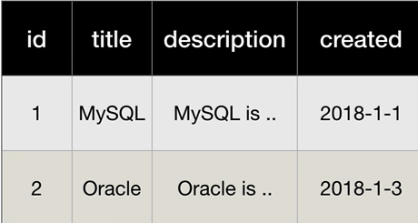
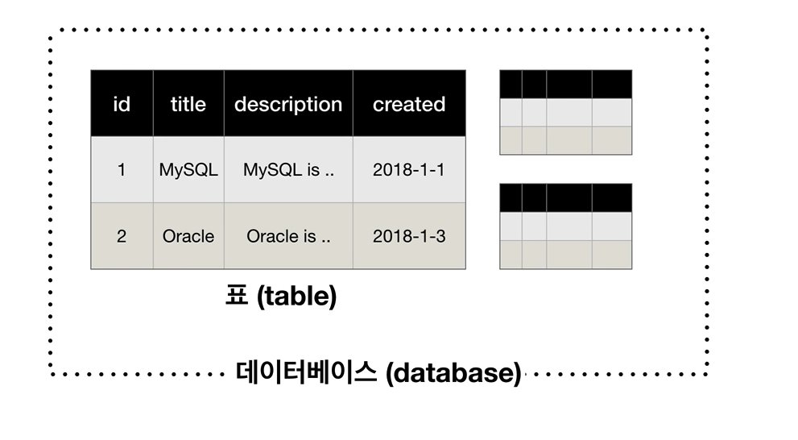
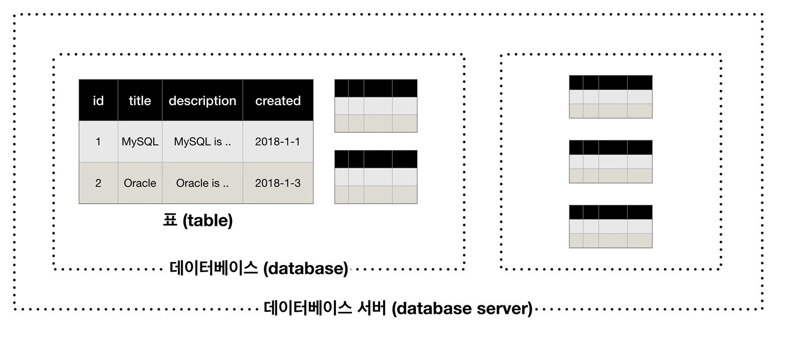
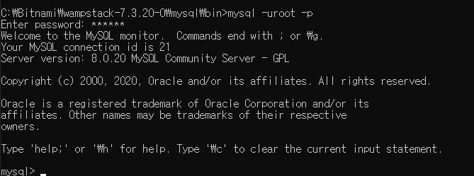
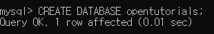
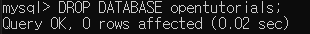
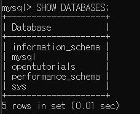
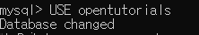
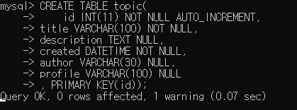

# MySQL   

MySQL Structure
=====

1. Table
   
      

2. Database , Schema
   
       

3. Database server
  
       
 

 MySQL Tutorial
=====
 **1. MySQL Execution**
    

  **2. Create DataBase**

    

  **3. Delete DataBase**
  
    

  **4. Show DataBase**
  
    

 **5. Use DataBase**
  
    
 

 Generation of tables
=====

 **1. Change Database**
  
    
 

Data Type : http://tcpschool.com/mysql/mysql_datatype_numeric  

**2. Create Table**
  
    
 
