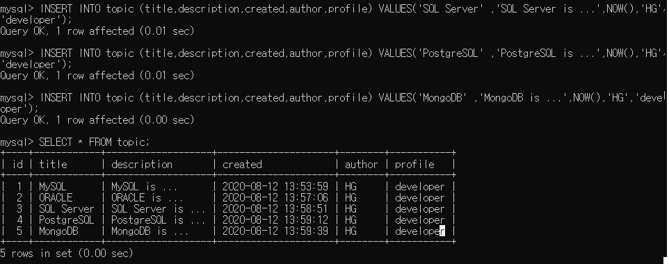
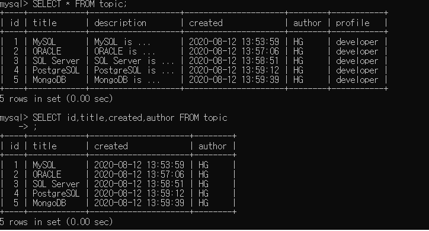
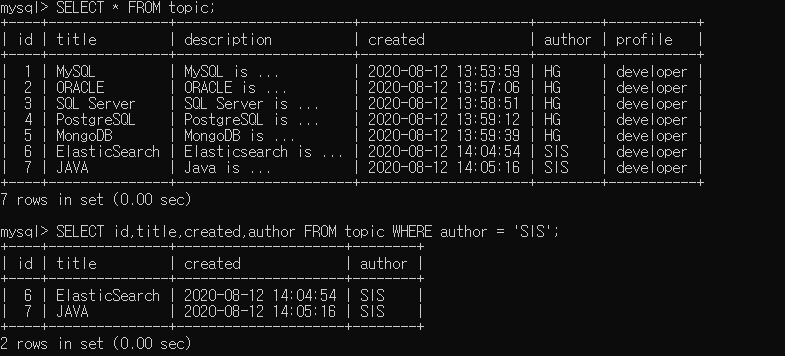
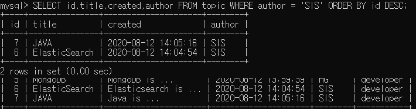
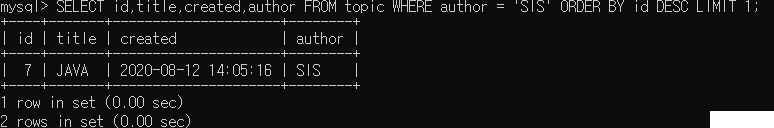

# MySQL   

MySQL Structure
=====

1. Table
   
      

2. Database , Schema
   
       

3. Database server
  
       
 

 MySQL Tutorial
=====
 ## **1. MySQL Execution**

    

  ## **2. Create DataBase**

    

  ## **3. Delete DataBase**
  
    

  ## **4. Show DataBase**
  
    

 ## **5. Use DataBase**
  
    
 

 Generation of tables
=====

 ## **1. Change Database**
  
    
 

## **2. Create Table**
  
  
 Data Type : http://tcpschool.com/mysql/mysql_datatype_numeric    
## **3. INSERT**

      
 
## **4. SELECT**

 ### *[FROM]*
   
 

 ### *[WHRER]*
    
 
  ### *[Order BY]*
    
 
  ###  *[LIMIT]*
      
 

 ## **5. UPDATE**

###  *[description . title Update]*
      

  ## **6. Delete**
###  *[id = 5 delete]*
      