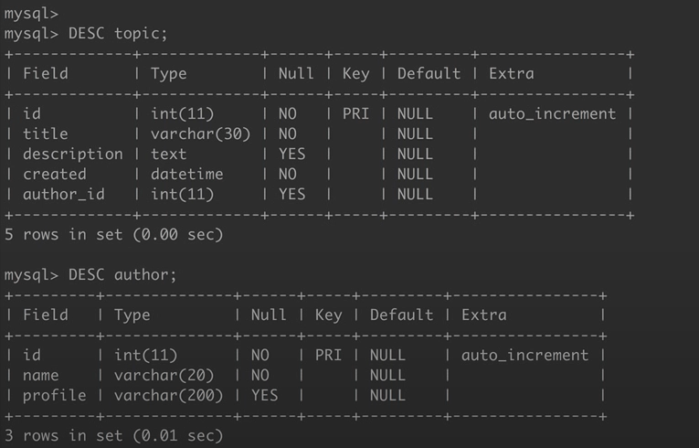
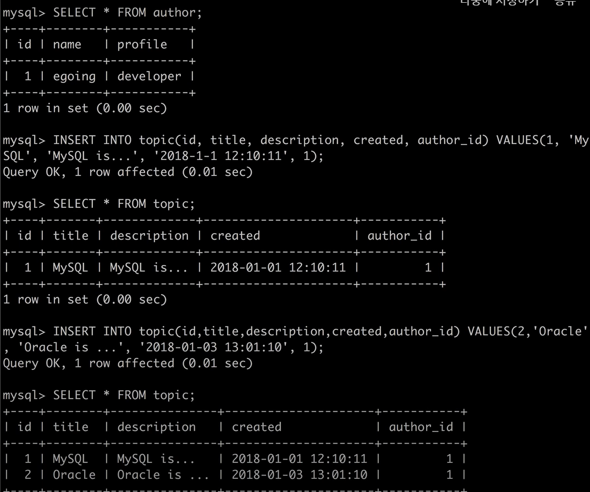
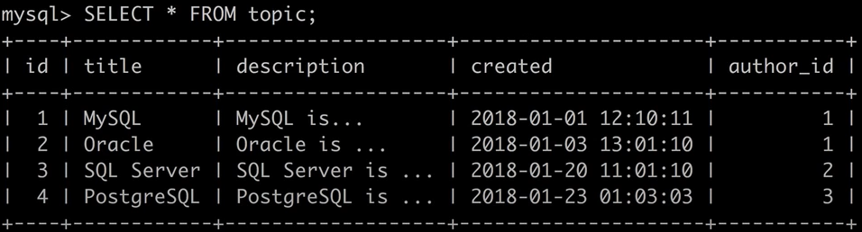
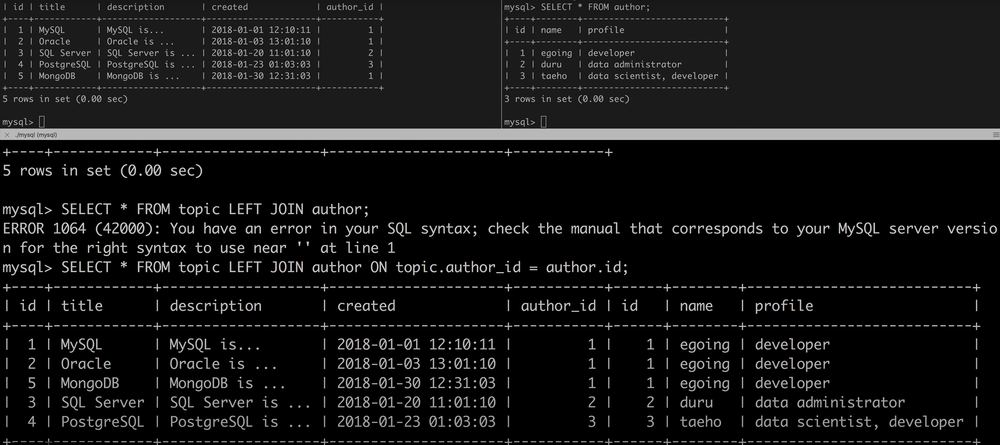
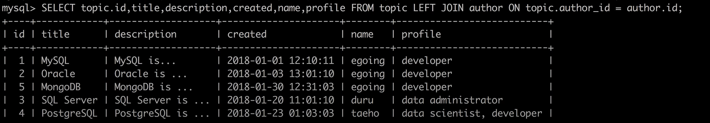
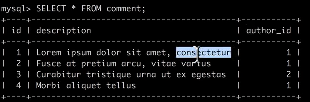
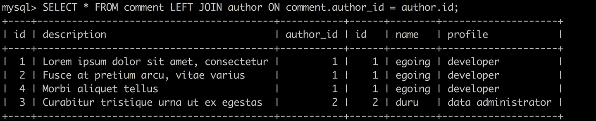
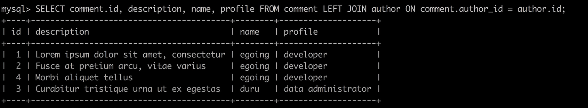
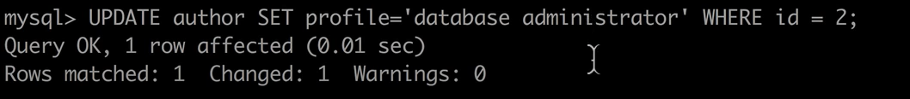
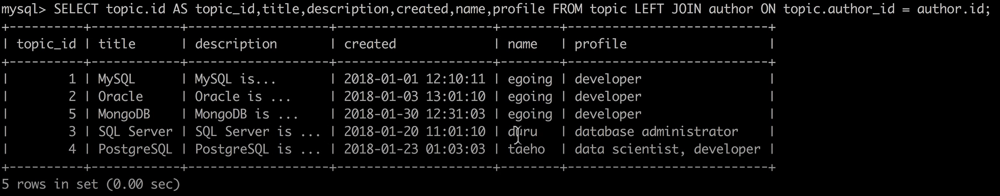

MySQL Database
=====

## Management the data through MySQL with Relational database.    

# Management Relational database.

## **1.Database Server** 
### Create 2 tables
    
      
  
### INSERT (author_id = 1 , 2, 3)
    
   
      
  

## **2.JOIN*****

### [1. Associates data that match the value of another_id in the topic table with the value of id in the author table.]

### [2.The two tables were connected by the author_id of the topic and the id of the authortable, so only the rest of the information except the relationship is printed.]

   

### [3.Create a comment table as shown below.]
   

### [4.Outputs the value of author_id on the comment table in conjunction with the id value of the author table..]

   

## -As shown in the above process, data was printed through a relational database. In this case, the advantage of relational data base is to inquire the value of id instead of changing the data every day, so when the data is UPDATE and re-printed, we want to check if the changed value is printed properly.   

### [1.changed the ID value of the author table.]

### [2. We could see that the changed value was connected normally.]

