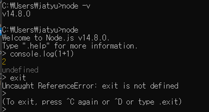
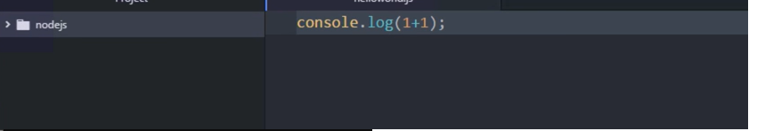
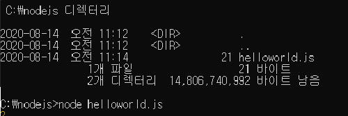
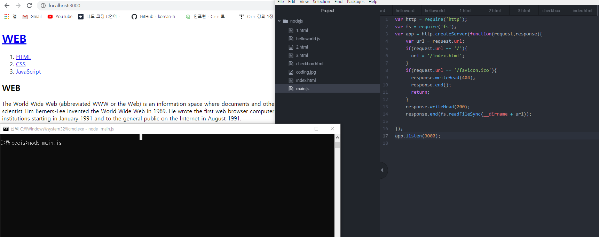
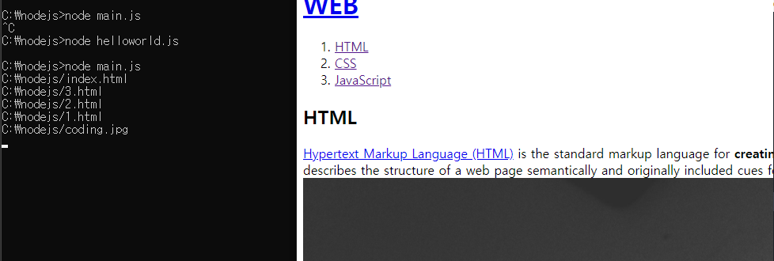
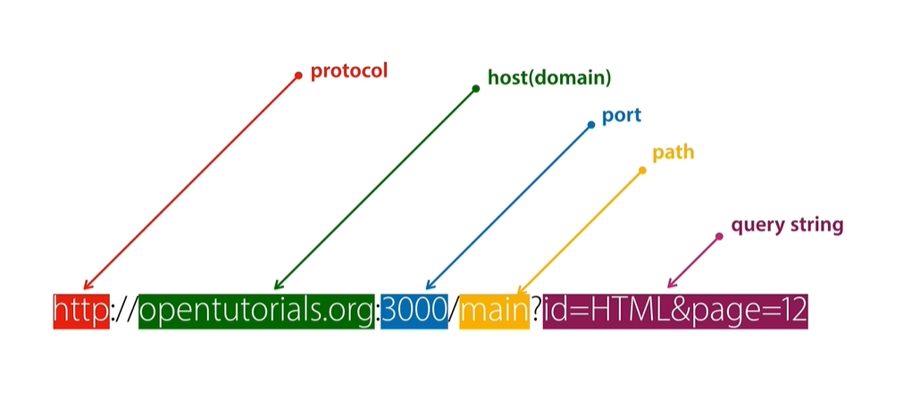
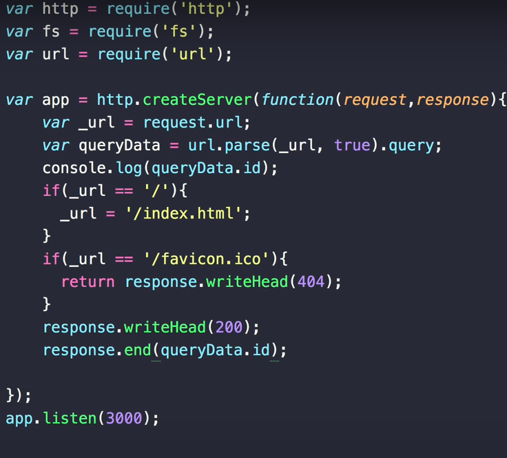
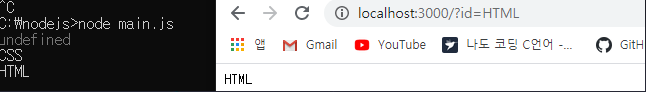
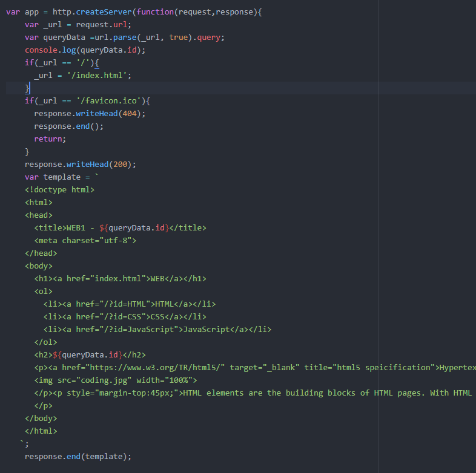
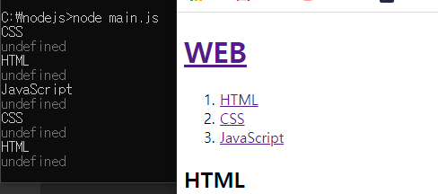

Node.js
=====

## **Nods.js**

### Check the installed version and have the 1+1 operation result printed on the console before shutting down.
    
      

  ### Because it is very annoying to enter commands, to write what needs to be done to the file in advance and then use a program called atom to take the action that was written when the file was called in.

  
     

  ### The goal is to study the language of Java scripts, study the functions of Nodes.js, and then configure the Nodes.js application.    

## **Creating a Web server with Node.js**

### Node.js working as web server3

  
         
  

 ## **URL** 

      
  
  ### check to receive different information based on the query string

   
      

   ## **Create dynamic web pages**

   
   

   ### When you click HTML, CSS, or JavaScript, you can see that the name of the Title changes.    

